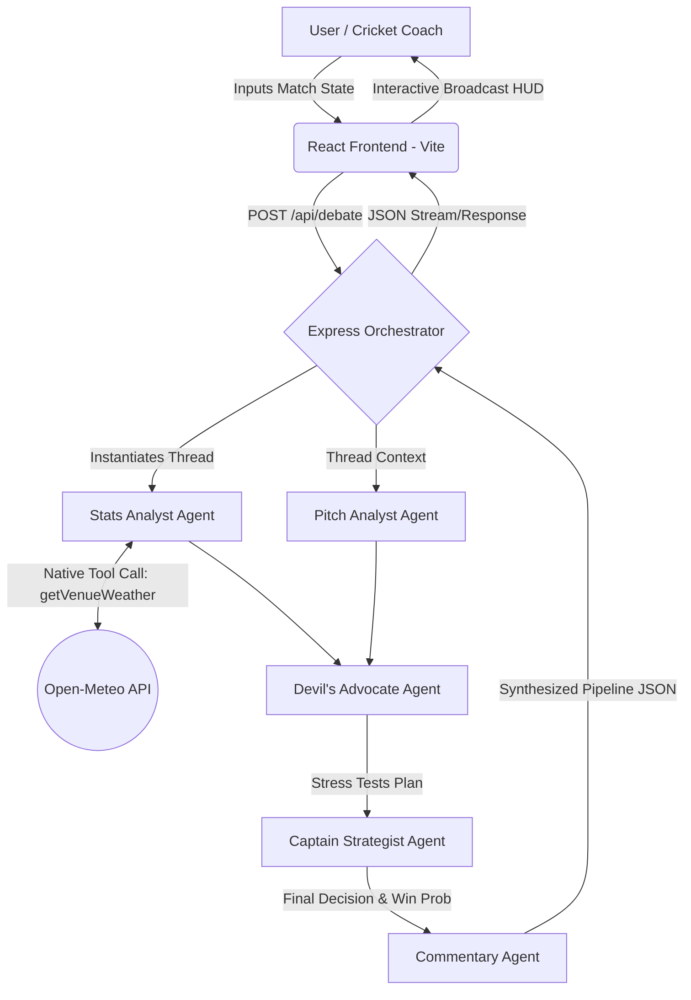

# Captain Cool AI
### Multi-Agent IPL Match Strategist Powered by Google Gemini 2.5 Flash

Captain Cool AI is a production-ready, futuristic sports-broadcast style dashboard that acts as a digital dugout. It orchestrates **5 specialized AI agents** inside a collaborative debate mesh to analyze complex T20 match situations, execute live meteorological tool calls, evaluate counterfactual risks, and propose champion-level tactical decisions with high-fidelity confidence scores.

---

## Banner & Live Demo Preview


---

## Problem Statement
In high-stakes T20 cricket like the IPL, decision-making is incredibly fast-paced. Coaches and captains are flooded with raw data: matchups, venue humidity, run rates, boundary dimensions, and player history. 

However:
- **Data alone lacks strategy**: Generic raw metrics do not translate into situational dugout wisdom.
- **Biased decisions cost matches**: Captains make instinctual choices without stress-testing worst-case risks.
- **Generic AI is flat**: Standard single-agent LLM prompts fail to weigh complex, competing perspectives.

**Why it matters:** A single tactical error (e.g., bowling a spinner with heavy dew, or bad field placements against a hitter) instantly flips a 100-crore franchise match.

---

## Solution
**Captain Cool AI** solves this by establishing a **Multi-Agent Orchestration Mesh** that acts as a real-time advisory committee. Instead of a single flat answer, specialized Gemini agents—each with distinct roles, system prompts, and tool access—sequentially debate the match situation:
1. **The Stats Analyst** fetches real-world weather data.
2. **The Pitch Analyst** determines swing and spin.
3. **The Devil's Advocate** stress-tests proposed plans.
4. **The Captain Strategist** synthesizes the final decisions.
5. **The Commentator** brings Shastri-style hype to the output.

---

## Features
- **Sequential Multi-Agent Debate**: Watch specialized Gemini agents discuss and challenge your tactical decisions in real time.
- **Native Weather Tool Calling**: Real-time stadium telemetry (temperature, humidity, dew warnings) fetched dynamically from the **Open-Meteo API** using native Gemini Function Calling.
- **Futuristic Sports HUD Aesthetic**: Gorgeous dark-mode styling with custom neon borders, active score widgets, animated CSS waveforms, and spring-physics page routing.
- **Win Probability Gauge**: Beautiful custom SVG radial gauge displaying real-time confidence scores and counterfactual situational analysis.
- **Live Match Importer (Preview)**: A clean live scoreboard parser designed to ingest Cricbuzz and ESPN Cricinfo scorecards.
- **Voice dugout Captain (Preview)**: Speak questions directly to the dugout and simulate audio-visual Dhoni-style responses.
- **Visual Architecture Blueprint**: A live graphical walkthrough demonstrating the orchestrated five-agent step-by-step pipeline.

---

## Tech Stack

### Frontend
- **Framework**: React 18 + Vite
- **Styling**: Tailwind CSS v3 + Custom HSL Variables
- **Animations**: Framer Motion (spring transitions, stagger feeds, particles)
- **Icons**: Lucide React (Premium emoji-free sports layout)

### Backend
- **Runtime**: Node.js + Express
- **AI SDK**: Official `@google/genai` (Agent Development Kit approach)

### Database / Telemetry
- **API integrations**: Open-Meteo Meteorological API (Grounded Weather coordinates)

### AI Model
- **Core LLM**: `gemini-2.5-flash` (Engineered for multi-turn reasoning speed & native tool schema execution)

---

## Architecture Diagram



---

## How It Works (Step-by-Step Flow)
1. **Match Initialization**: The coach inputs stadium venue, striker details, bowler, batting/bowling teams, and exact scorecard values.
2. **Environmental Grounding**: The **Stats Analyst** executes a tool call using stadium coordinates to retrieve real-time weather telemetry. Dew risk is calculated based on temperature-to-humidity thresholds.
3. **Drafting Strategy**: The **Pitch Analyst** outlines specific game plans based on match phase (Powerplay/Middle/Death) and weather.
4. **Stress Testing**: The **Devil's Advocate** acts as a cynic, aggressively finding flaws in the proposed strategy (e.g. bowler matchup risks, boundary configurations).
5. **Dhoni-Style Decision**: The **Captain Strategist** consumes the entire debate log, makes a final structured decision, outputs counterfactual alternatives, and scores the win probability.
6. **Hype Generation**: The **Commentator** translates the outcome into an authentic, energetic IPL commentator commentary block.

---

## Installation & Local Development

### Prerequisites
- Node.js (v18+ recommended)
- NPM or Yarn
- A Google Gemini API Key (from Google AI Studio)

### Step 1: Clone the Repository
```bash
git clone https://github.com/VIDYANKSHINI/Captain-Cool.git
cd Captain-Cool
```

### Step 2: Set up the Backend
```bash
cd backend
npm install
```
Configure your environment variables:
Create a `.env` file in the `/backend` folder:

Start the backend service:
```bash
npm run dev
```

### Step 3: Set up the Frontend
In a new terminal window:
```bash
cd ../frontend
npm install
npm run dev
```
Open [http://localhost:5173](http://localhost:5173) in your web browser.

---


## Usage Guide
1. Launch the application and enter the **Strategy Room** via the navigation bar.
2. Enter the current match context (e.g. CSK vs MI, Wankhede Stadium, Striker name, Target to defend, Current Bowler).
3. Hit **Initialize Strategy Protocol**.
4. Watch the telemetry box load live stadium metrics, followed by the sequential staggering debate thread of the specialized agents.
5. Click on individual cards to expand detailed debate logs, view the confidence meter, and copy Shastri-AI commentary transcripts.

---

## API Endpoints

### 1. Execute Multi-Agent Debate
*   **Endpoint**: `/api/debate`
*   **Method**: `POST`
*   **Content-Type**: `application/json`
*   **Payload**:
```json
{
  "battingTeam": "Chennai Super Kings",
  "bowlingTeam": "Mumbai Indians",
  "score": "180/4",
  "overs": "18.2",
  "target": "195",
  "striker": "MS Dhoni (28 off 12)",
  "nonStriker": "Ravindra Jadeja (12 off 8)",
  "bowler": "Jasprit Bumrah",
  "venue": "Wankhede Stadium, Mumbai",
  "impactPlayerAvailable": true
}
```
*   **Response**:
```json
{
  "weather": {
    "temperature": "29°C",
    "humidity": "78%",
    "dewWarning": "High",
    "isRealData": true
  },
  "timeline": [
    { "agent": "Stats Analyst", "role": "analyst", "text": "..." },
    { "agent": "Pitch Analyst", "role": "pitch", "text": "..." },
    { "agent": "Devil's Advocate", "role": "devil", "text": "..." },
    { "agent": "Captain Strategist", "role": "captain", "confidence": "85", "text": "..." },
    { "agent": "Commentator", "role": "commentary", "text": "..." }
  ]
}
```

---

## AI / Agent Workflow & Prompts

### Agent Personas
*   **Stats Analyst**: Strict, data-driven, calculating. Translates coordinates, evaluates moisture levels, and warns about bowlers' average ER under dew.
*   **Pitch Analyst**: Conditions assessor. Focuses on spin index, turf hardness, boundary metrics, and swing duration.
*   **Devil's Advocate**: Severe risk analyst. Evaluates counter-matchups, potential dropped catches, edge cases, and run-rate pressures.
*   **Captain Strategist (MS Dhoni Cognitive Clone)**: Calm, situational, intuitive, and decisive. Balances risk, optimizes field placements, and chooses the highest probability of success.

---

## Screenshots

| Landing Page (Hero Section) | Strategy Room Dashboard |
|---|---|
|  |  |

---

## Folder Structure
```
Captain-Cool/
├── backend/
│   ├── src/
│   │   ├── controllers/
│   │   │   └── debateController.js    # Multi-agent orchestrator & prompt pipelines
│   │   ├── services/
│   │   │   ├── geminiService.js       # @google/genai client initialization & function calling
│   │   │   └── weatherService.js      # Open-Meteo API integrations
│   │   └── index.js
│   ├── .env
│   └── package.json
└── frontend/
    ├── src/
    │   ├── components/
    │   │   ├── AgentCard.jsx          # Interactive accordions with custom icons
    │   │   ├── FinalDecisionCard.jsx  # SVG Radial Gauge with MS Dhoni decision UI
    │   │   ├── MatchInputForm.jsx     # Clean sport HUD custom dropdowns
    │   │   └── Navbar.jsx             # Neon glassmorphism responsive nav
    │   ├── pages/
    │   │   ├── LandingPage.jsx        # Floating widgets, scroll indices, particle canvas
    │   │   ├── Dashboard.jsx          # Main Strategy dugout feed
    │   │   ├── LiveMatchMode.jsx      # Cricbuzz import page preview
    │   │   ├── VoiceCaptain.jsx       # CSS waveform mic preview page
    │   │   └── ArchitecturePage.jsx   # Live system blueprint
    │   ├── index.css                  # Custom styling overrides & global animations
    │   └── App.jsx
    ├── tailwind.config.js
    └── postcss.config.js
```

---

## Future Scope
- **Interactive SVG Fielding Map**: A clickable 2D cricket stadium SVG where dots dynamically arrange to match the Captain's field placements.
- **Deep Historical Scorecard RAG**: Grounding the Stats Agent using a vector database populated with historical IPL ball-by-ball scorecards.
- **Full Speech synthesis**: Using the Google Cloud Text-to-Speech API to vocalize Shastri-AI's commentaries.

---

## Challenges Faced & Key Learnings
*   **Tailwind ESM PostCSS Class compilation**: Downgraded to Tailwind v3 and declared custom background colors using global CSS variables inside `index.css` to bypass static config resolution errors in ESM.
*   **Lucide React Version imports**: Handled version-specific exports elegantly by swapping missing icons for standard high-end components to guarantee hot reloading without compilation locks.
*   **Real Function Calling groundings**: Handled meteorological telemetry coordinates dynamically by implementing rigorous weather parameter fallbacks to avoid crashes during high API traffic.

---

## Team Members
- **Vidyankshini** - Full-Stack Developer & AI Systems Engineer

---


## Acknowledgements
- GDG Cloud Pune & Google AI Studio organizers for the Agentic Premier League hackathon.
- The Open-Meteo meteorological database.
- Every cricket captain who ever trusted their gut in the final over of an IPL final.
