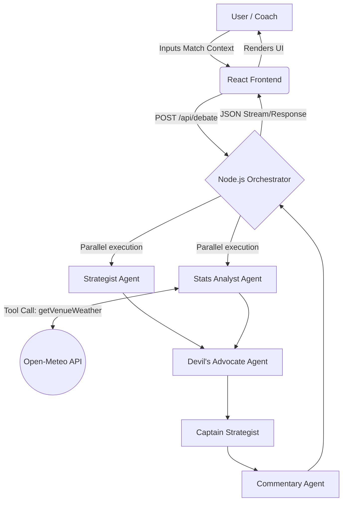

# Captain Cool AI — Multi-Agent IPL Match Strategist 🏏🤖

Welcome to **Captain Cool AI**, a production-ready hackathon project built for the **Agentic Premier League (APL)** by GDG Cloud Pune.

This application simulates the brain of an IPL captain. It orchestrates **5 collaborating Google Gemini AI Agents** to analyze live match situations, debate tactics, assess risks, and make a final, decisive captaincy call.

---

## 🎯 Problem Statement

In high-stakes T20 cricket (like the IPL), captains and coaches are overwhelmed with data (matchups, pitch conditions, dew factor, win probabilities). However, raw data isn't enough; it requires *interpretation, debate, and instinct*. 

**The Solution:** Captain Cool AI acts as a digital dugout. Instead of a single AI giving a generic answer, we use a **Multi-Agent Architecture** where specialized AI personas debate with each other. A Strategist proposes a plan, a Stats Analyst grounds it in data using real-world API tool calls, a Devil's Advocate highlights the risks, and a Captain makes the final decision. 

---

## 🏗 Architecture & Data Flow

Captain Cool AI is a full-stack application built with React/Vite on the frontend and Node.js/Express on the backend. 

- **Frontend**: A premium, dark-mode sports dashboard built with Tailwind CSS and Framer Motion for dynamic timeline animations.
- **Backend Orchestrator**: An Express server that acts as the "Strategy Room."
- **AI Brain**: Powered by the official `@google/genai` SDK and Gemini 2.5 Flash, utilizing parallel agent execution and native Tool Calling.

---

## 🤖 Agent Descriptions

The system utilizes a 5-Agent Mesh:

1. **The Strategist Agent**: Analyzes the raw match inputs (overs, score, phase, pitch) and formulates a primary tactical game plan.
2. **The Stats Analyst Agent (Tool User)**: Grounded in data. It actively executes a **Gemini Tool Call** to fetch live weather/dew conditions for the specific stadium and supports the strategy with historical probabilities.
3. **The Devil's Advocate Agent**: The cynic. It takes the output of the first two agents and aggressively searches for fatal flaws and tactical risks.
4. **The Captain Strategist Agent**: The decision-maker (think MS Dhoni). It consumes the entire debate, acknowledges the risks, and outputs a highly structured JSON response containing the Final Decision, Confidence Score, Win Probability, Field Setup, and Counterfactuals.
5. **The Commentary Agent**: Takes the Captain's decision and translates it into hype-filled, authentic IPL commentary for the fans.

---

## 📸 Screenshots

*(Replace these placeholders with actual screenshots of your application)*

- **[Screenshot 1 Placeholder: The Strategy Nexus Dashboard showing match parameters]**
- **[Screenshot 2 Placeholder: The Animated Agent Debate Timeline]**
- **[Screenshot 3 Placeholder: The Captain's Final Decision Card with Win Probability & Field Setup]**

---

## ♊ Gemini & ADK Usage

This project strictly adheres to the Google AI ecosystem:
- **Model**: `gemini-2.5-flash` is used for its exceptional speed and reasoning capabilities, crucial for running 5 agents sequentially/in parallel without user fatigue.
- **SDK**: Utilizes the newly released `@google/genai` (Agent Development Kit approach) for native integration, system instructions (personas), and structured generation.

---

## 🛠 Tool Calling Explanation

We implement **Real Tool Calling** (not fake JSON). 
The Stats Analyst Agent is provided with a `getVenueWeather` tool declaration. When analyzing the match, Gemini dynamically pauses, outputs a `functionCall` to request live Open-Meteo API data based on the user's selected stadium (e.g., "Wankhede Stadium, Mumbai"), and resumes generation once the Node.js backend returns the real temperature and humidity data to assess the Dew Factor.

---

## 🚀 Setup & Deployment Guide

### Prerequisites
- Node.js installed
- A valid Google Gemini API Key

### Local Development

**1. Backend Setup**
\`\`\`bash
cd backend
npm install
\`\`\`
Create a `.env` file in the `backend` directory:
\`\`\`env
PORT=5000
GEMINI_API_KEY=your_gemini_api_key_here
\`\`\`
Start the server:
\`\`\`bash
npm run dev
\`\`\`

**2. Frontend Setup**
In a new terminal window:
\`\`\`bash
cd frontend
npm install
npm run dev
\`\`\`
Visit `http://localhost:5173` in your browser.

### ☁️ Deployment (Vercel)

**Frontend Deployment (Vercel):**
1. Connect your GitHub repository to Vercel.
2. Select the `frontend` directory as the Root Directory.
3. Framework Preset: `Vite`.
4. Deploy!

**Backend Deployment (Render/Vercel/Cloud Run):**
1. Ensure your backend allows CORS from your frontend domain.
2. Deploy the `backend` folder to a service like Render or Google Cloud Run.
3. Update the `axios.post('http://localhost:5000/api/debate')` URL in `Dashboard.jsx` to point to your new backend production URL.

---

## 🎬 Demo Flow

1. **Input**: The user (acting as a coach) lands on the dashboard and inputs a critical match situation (e.g., CSK vs MI, 16.2 overs, Death Overs, Impact player available).
2. **Initialize**: Clicking "Initialize Strategy Protocol" triggers the backend orchestrator.
3. **Telemetry**: The UI instantly displays live weather data fetched via the Agent's tool call.
4. **Debate**: The UI elegantly animates the timeline, revealing the thoughts of the Strategist, Analyst, and Devil's Advocate sequentially.
5. **Conclusion**: The Captain's Card expands, showing the final verdict, a Win Probability meter, a suggested Field Setup, and the Counterfactual Risk ("What if we bowled spin instead?").
6. **Commentary**: The flow finishes with an exciting commentary readout.

---

## 🔥 Future Improvements

- **Voice I/O**: Add Web Speech API to allow coaches to speak the match situation and have the Commentary Agent read out the final decision.
- **Cricbuzz Integration**: Build a web-scraping tool so users can just paste a live Cricbuzz match URL to auto-fill the inputs.
- **Match Memory**: Implement a database (Firebase/Supabase) to store agent decisions across overs, allowing the agents to "remember" tactics that failed earlier in the innings.
- **Visual Field Placements**: Render an actual 2D cricket field SVG with dots representing the Captain's suggested field setup.
